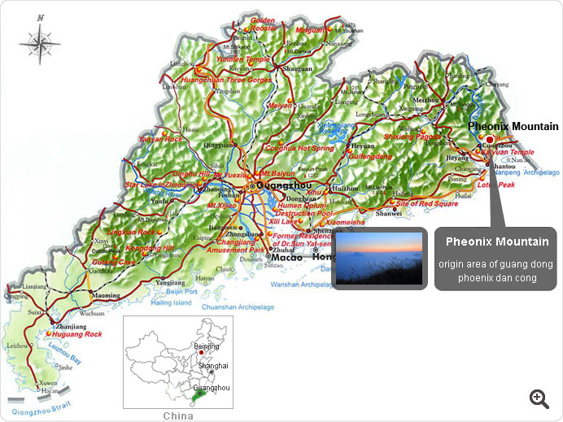

---
title: "tea information sheet"
author: Emil Rehnberg
bibliography: refs.bib
csl: shiki.csl
output:
  pdf_document:
    highlight: zenburn
  html_document:
    toc_float: TRUE
    css: styles.css
---

```{r set-options, echo=FALSE, cache=FALSE}
options(width = 200)
```

```{r echo=FALSE, eval=FALSE}
require(rmarkdown); require(shiny)
rmdFilePath <- "tea.rmd"
rmarkdown::render(rmdFilePath, output_format="html_document") # "all_document"
```

## 目的

This is a document for summarising tea information. For look-up. (some of this goes into Anki so I might as well collect it here)

### 烏龍茶 { .tabset .tabset-fade .tabset-pills }

#### 鐵觀音

- 铁观音。"Iron Goddess of Mercy" tiěguānyīn
- From Anxi County, Fujian Province, China.

#### Jin Guan Yin

- From Anxi County, Fujian Province, China.

#### 大紅袍。

- Da Hong Pao. "Big Red Robe"
- From Wuyi shan, Fujian Province, China.
- a Si Da Ming Cong tea (whatever that means).
- One of the two oolongs that make it to the list of Chinese famous teas.

#### Rougui

- From Wuyi shan, Fujian Province, China.
- "Cassia"
- a dark tea with a spicy aroma.

#### 凤凰单丛茶

- Fenghuang Dancong / Phoenix Single Bush
- Guangdong Province, China.
- Phoenix refers to Phoenix Mountain.
- noted for their ability to naturally imitate the flavors and fragrances of various flowers and fruits, such as orange blossom, orchid, grapefruit, almond, ginger flower, etc.
- The name dan cong originally meant phoenix teas all picked from one tree. In recent times though it has become a generic term for all Phoenix Mountain oolongs.
- True dan congs are still being produced, but they are extremely high quality and almost impossible to get in western markets.
- Song Dynasty tribute tea for the emperor.
- This tea have long dark brown leaves.
- When brewed it produces
    - a light yellow liquor
    - floral fragrance and honey peach taste
    - great aftertaste
- very popular in southern China.



#### Dong Ding

Taiwanese.

#### Alishan

Taiwanese.

#### Lishan

Taiwanese.


